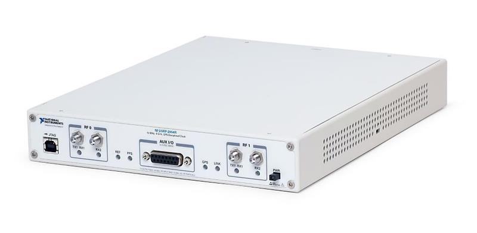

# 2952R

<p align="center">
  
</p>

```
➜  ~ sudo ifconfig enp1s0f0 192.168.40.100/24
➜  ~ ping 192.168.40.2                       
PING 192.168.40.2 (192.168.40.2) 56(84) bytes of data.
64 bytes from 192.168.40.2: icmp_seq=1 ttl=32 time=1.02 ms
64 bytes from 192.168.40.2: icmp_seq=2 ttl=32 time=0.600 ms
64 bytes from 192.168.40.2: icmp_seq=3 ttl=32 time=0.602 ms
^C
--- 192.168.40.2 ping statistics ---
3 packets transmitted, 3 received, 0% packet loss, time 2016ms
rtt min/avg/max/mdev = 0.600/0.739/1.015/0.195 ms
➜  ~ 
```

```
➜  ~ uhd_find_devices
[INFO] [UHD] linux; GNU C++ version 12.3.0; Boost_107400; UHD_4.7.0.HEAD-0-ga5ed1872
--------------------------------------------------
-- UHD Device 0
--------------------------------------------------
Device Address:
    serial: 3105AFE
    addr: 192.168.40.2
    fpga: HG
    name: 
    product: X310
    type: x300


➜  ~ 
```

```
➜  ~ uhd_usrp_probe --args="addr=192.168.40.2"             
[INFO] [UHD] linux; GNU C++ version 12.3.0; Boost_107400; UHD_4.7.0.HEAD-0-ga5ed1872
[INFO] [X300] X300 initialization sequence...
Error: RuntimeError: Expected FPGA compatibility number 39.0, but got 38.0:
The FPGA image on your device is not compatible with this host code build.
Download the appropriate FPGA images for this version of UHD.
Please run:

 "/usr/local/lib/uhd/utils/uhd_images_downloader.py"

Then burn a new image to the on-board flash storage of your
USRP X3xx device using the image loader utility. Use this command:

"/usr/local/bin/uhd_image_loader" --args="type=x300,addr=192.168.40.2"

For more information, refer to the UHD manual:

 http://files.ettus.com/manual/page_usrp_x3x0.html#x3x0_flash
➜  ~ "/usr/local/bin/uhd_image_loader" --args="type=x300,addr=192.168.40.2" 
[INFO] [UHD] linux; GNU C++ version 12.3.0; Boost_107400; UHD_4.7.0.HEAD-0-ga5ed1872
Unit: USRP X310 (3105AFE, 192.168.40.2)
FPGA Image: /usr/local/share/uhd/images/usrp_x310_fpga_HG.bit
-- Initializing FPGA loading...successful.
-- Loading HG FPGA image: 100% (121/121 sectors)
-- Finalizing image load...successful.
Power-cycle the USRP X310 to use the new image.
```

```
➜  ~ uhd_usrp_probe --args="addr=192.168.40.2"                             
[INFO] [UHD] linux; GNU C++ version 12.3.0; Boost_107400; UHD_4.7.0.HEAD-0-ga5ed1872
[INFO] [X300] X300 initialization sequence...
[INFO] [X300] Maximum frame size: 1472 bytes.
[WARNING] [X300] For the 192.168.40.2 connection, UHD recommends a send frame size of at least 8000 for best
performance, but your configuration will only allow 1472.This may negatively impact your maximum achievable sample rate.
Check the MTU on the interface and/or the send_frame_size argument.
[WARNING] [X300] For the 192.168.40.2 connection, UHD recommends a receive frame size of at least 8000 for best
performance, but your configuration will only allow 1472.This may negatively impact your maximum achievable sample rate.
Check the MTU on the interface and/or the recv_frame_size argument.
[INFO] [GPS] Found an internal GPSDO: LC_XO, Firmware Rev 0.929a
[INFO] [X300] Radio 1x clock: 200 MHz
  _____________________________________________________
 /
|       Device: X-Series Device
|     _____________________________________________________
|    /
|   |       Mboard: X310
|   |   revision: 10
|   |   revision_compat: 7
|   |   product: 30808
|   |   mac-addr0: 00:80:2f:16:66:c5
|   |   mac-addr1: 00:80:2f:16:66:c6
|   |   gateway: 192.168.10.1
|   |   ip-addr0: 192.168.10.2
|   |   subnet0: 255.255.255.0
|   |   ip-addr1: 192.168.20.2
|   |   subnet1: 255.255.255.0
|   |   ip-addr2: 192.168.30.2
|   |   subnet2: 255.255.255.0
|   |   ip-addr3: 192.168.40.2
|   |   subnet3: 255.255.255.0
|   |   serial: 3105AFE
|   |   FW Version: 6.1
|   |   FPGA Version: 39.3
|   |   FPGA git hash: c37b318
|   |   Device DNA: 00702C0150F1085C
|   |   RFNoC capable: Yes
|   |   
|   |   Time sources:  internal, external, gpsdo
|   |   Clock sources: internal, external, gpsdo
|   |   Sensors: gps_servo, gps_time, gps_locked, gps_gprmc, gps_gpgga, ref_locked
|     _____________________________________________________
|    /
|   |       RFNoC blocks on this device:
|   |   
|   |   * 0/DDC#0
|   |   * 0/DDC#1
|   |   * 0/DUC#0
|   |   * 0/DUC#1
|   |   * 0/Radio#0
|   |   * 0/Radio#1
|   |   * 0/Replay#0
|     _____________________________________________________
|    /
|   |       Static connections on this device:
|   |   
|   |   * 0/SEP#0:0==>0/DUC#0:0
|   |   * 0/DUC#0:0==>0/Radio#0:0
|   |   * 0/Radio#0:0==>0/DDC#0:0
|   |   * 0/DDC#0:0==>0/SEP#0:0
|   |   * 0/Radio#0:1==>0/DDC#0:1
|   |   * 0/DDC#0:1==>0/SEP#1:0
|   |   * 0/SEP#2:0==>0/DUC#1:0
|   |   * 0/DUC#1:0==>0/Radio#1:0
|   |   * 0/Radio#1:0==>0/DDC#1:0
|   |   * 0/DDC#1:0==>0/SEP#2:0
|   |   * 0/Radio#1:1==>0/DDC#1:1
|   |   * 0/DDC#1:1==>0/SEP#3:0
|   |   * 0/SEP#4:0==>0/Replay#0:0
|   |   * 0/Replay#0:0==>0/SEP#4:0
|   |   * 0/SEP#5:0==>0/Replay#0:1
|   |   * 0/Replay#0:1==>0/SEP#5:0
|     _____________________________________________________
|    /
|   |       TX Dboard: 0/Radio#0
|   |   ID: SBX v5 (0x0068)
|   |   Serial: 310232A
|   |   Revision: 2
|   |     _____________________________________________________
|   |    /
|   |   |       TX Frontend: 0
|   |   |   Name: SBX/CBX TX
|   |   |   Antennas: TX/RX, CAL
|   |   |   Sensors: lo_locked
|   |   |   Freq range: 400.000 to 4400.000 MHz
|   |   |   Gain range PGA0: 0.0 to 31.5 step 0.5 dB
|   |   |   Bandwidth range: 40000000.0 to 40000000.0 step 0.0 Hz
|   |   |   Connection Type: QI
|   |   |   Uses LO offset: No
|     _____________________________________________________
|    /
|   |       RX Dboard: 0/Radio#0
|   |   ID: SBX v5 (0x0069)
|   |   Serial: 310232A
|   |   Revision: 2
|   |     _____________________________________________________
|   |    /
|   |   |       RX Frontend: 0
|   |   |   Name: SBX/CBX RX
|   |   |   Antennas: TX/RX, RX2, CAL
|   |   |   Sensors: lo_locked
|   |   |   Freq range: 400.000 to 4400.000 MHz
|   |   |   Gain range PGA0: 0.0 to 31.5 step 0.5 dB
|   |   |   Bandwidth range: 40000000.0 to 40000000.0 step 0.0 Hz
|   |   |   Connection Type: IQ
|   |   |   Uses LO offset: No
|     _____________________________________________________
|    /
|   |       TX Dboard: 0/Radio#1
|   |   ID: SBX v5 (0x0068)
|   |   Serial: 310232F
|   |   Revision: 2
|   |     _____________________________________________________
|   |    /
|   |   |       TX Frontend: 0
|   |   |   Name: SBX/CBX TX
|   |   |   Antennas: TX/RX, CAL
|   |   |   Sensors: lo_locked
|   |   |   Freq range: 400.000 to 4400.000 MHz
|   |   |   Gain range PGA0: 0.0 to 31.5 step 0.5 dB
|   |   |   Bandwidth range: 40000000.0 to 40000000.0 step 0.0 Hz
|   |   |   Connection Type: QI
|   |   |   Uses LO offset: No
|     _____________________________________________________
|    /
|   |       RX Dboard: 0/Radio#1
|   |   ID: SBX v5 (0x0069)
|   |   Serial: 310232F
|   |   Revision: 2
|   |     _____________________________________________________
|   |    /
|   |   |       RX Frontend: 0
|   |   |   Name: SBX/CBX RX
|   |   |   Antennas: TX/RX, RX2, CAL
|   |   |   Sensors: lo_locked
|   |   |   Freq range: 400.000 to 4400.000 MHz
|   |   |   Gain range PGA0: 0.0 to 31.5 step 0.5 dB
|   |   |   Bandwidth range: 40000000.0 to 40000000.0 step 0.0 Hz
|   |   |   Connection Type: IQ
|   |   |   Uses LO offset: No

➜  ~ 
```

### [USRP 2952R Specifications](./pdfs/4148471.pdf)
