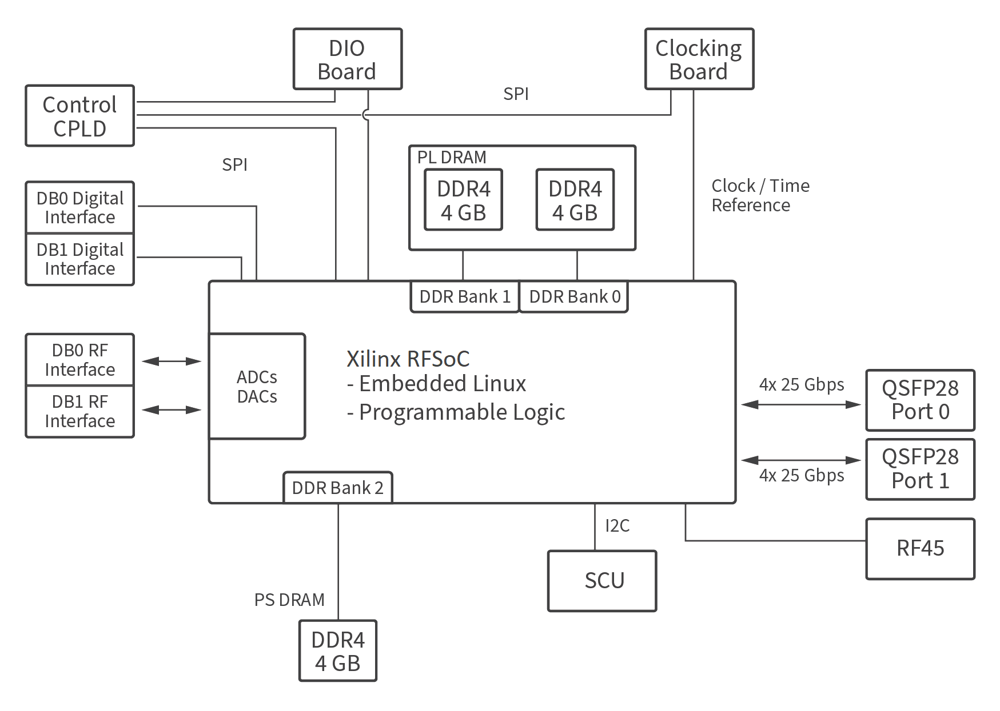
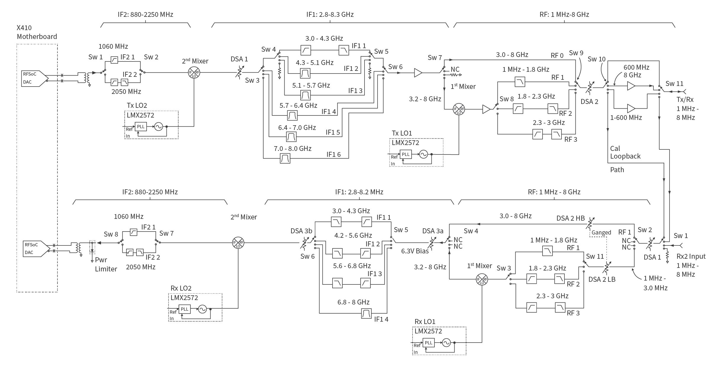

# x410

<p align="center">
  
  
</p>

### Features
* High channel density
* Reliable and fault-tolerant deployment
* Stand-alone (embedded) or host-based (network streaming) operation
* Fully integrated and assembled (the USRP X410 does not support swappable daughtercards)
* 1 MHz to 7.2 GHz frequency range (tunable up to 8GHz)
* Up to 400 MHz of instantaneous bandwidth per channel
* 4 RX, 4 TX in half-wide RU form factor
* Xilinx Zynq-Ultrascale+ ZU28DR RFSoC
* 12 bit ADC, 14 bit DAC
* IQ Sample Clock rates up to 500 MS/s
* Onboard SD-FEC, DDC, DUC
* Quad-core ARM Cortex-A53 up to 1.2 GHz CPU
* Dual-core ARM Cortex-A5 MPCore up to 500 MHz
* Two QSFP28 ports (10 Gigabit Ethernet, 100 Gigabit Ethernet, Aurora)
* Two iPass+™ zHD® Interfaces (PCIe Gen3 x 8)
* RJ45 (1 GbE) [1]
* 10 MHz Clock reference 
* PPS time reference
* Trig In/Out Interface
* Built-in GPSDO 
* Two FPGA Programmable GPIO Interfaces (HDMI)
* 1 Type C USB host port 
* 1 Type C USB port (serial console, JTAG) 
* Watchdog timer
* OpenEmbedded Linux
* USRP Hardware Driver™ (UHD) open-source software API version 4.1.0 or later
* RF Network on Chip (RFNoC™) FPGA development framework
* Xilinx Vivado® 2019.1 Design Suite (license not included)
* GNU Radio support is maintained by Ettus Research™ through GR-UHD, an interface to UHD distributed by GNU Radio
* [1] The RJ45 port is used for remote management of the device and does not support IQ streaming.


### Block Diagrams

Ettus USRP X410 Motherboard Block Diagram


Ettus USRP X410 ZBX Block Diagram



### Check connection

```zsh
➜  x410 git:(main) ✗ sudo ifconfig enp1s0f0 192.168.10.10/24

➜  x410 git:(main) ✗ ping 192.168.10.2
PING 192.168.10.2 (192.168.10.2) 56(84) bytes of data.
64 bytes from 192.168.10.2: icmp_seq=1 ttl=64 time=1.72 ms
^C
--- 192.168.10.2 ping statistics ---
1 packets transmitted, 1 received, 0% packet loss, time 0ms
rtt min/avg/max/mdev = 1.720/1.720/1.720/0.000 ms

➜  x410 git:(main) ✗ uhd_find_devices
[INFO] [UHD] linux; GNU C++ version 11.4.0; Boost_107400; DPDK_20.11; UHD_4.5.0.HEAD-0-g471af98f
--------------------------------------------------
-- UHD Device 0
--------------------------------------------------
Device Address:
    serial: 32DAFAA
    addr: 192.168.10.2
    claimed: False
    fpga: X4_200
    mgmt_addr: 192.168.10.2
    name: ni-x4xx-32DAFAA
    product: x410
    type: x4xx

➜  x410 git:(main) ✗ ssh root@192.168.10.2
The authenticity of host '192.168.10.2 (192.168.10.2)' can't be established.
ED25519 key fingerprint is SHA256:NlMKOvVSDDx1cwM/hj8bIbPEZPu1dXFExUAgPpsvFs0.
This key is not known by any other names
Are you sure you want to continue connecting (yes/no/[fingerprint])? yes
Warning: Permanently added '192.168.10.2' (ED25519) to the list of known hosts.
root@ni-x4xx-32DAFAA:~# 
```

## Check system info

```
root@ni-x4xx-32DAFAA:~# uname -a
Linux ni-x4xx-32DAFAA 5.10.37-x4xx #1 SMP Mon Nov 13 20:22:26 UTC 2023 aarch64 aarch64 aarch64 GNU/Linux

root@ni-x4xx-32DAFAA:~# cat /proc/cpuinfo
processor       : 0
BogoMIPS        : 66.66
Features        : fp asimd evtstrm aes pmull sha1 sha2 crc32 cpuid
CPU implementer : 0x41
CPU architecture: 8
CPU variant     : 0x0
CPU part        : 0xd03
CPU revision    : 4

processor       : 1
BogoMIPS        : 66.66
Features        : fp asimd evtstrm aes pmull sha1 sha2 crc32 cpuid
CPU implementer : 0x41
CPU architecture: 8
CPU variant     : 0x0
CPU part        : 0xd03
CPU revision    : 4

processor       : 2
BogoMIPS        : 66.66
Features        : fp asimd evtstrm aes pmull sha1 sha2 crc32 cpuid
CPU implementer : 0x41
CPU architecture: 8
CPU variant     : 0x0
CPU part        : 0xd03
CPU revision    : 4

processor       : 3
BogoMIPS        : 66.66
Features        : fp asimd evtstrm aes pmull sha1 sha2 crc32 cpuid
CPU implementer : 0x41
CPU architecture: 8
CPU variant     : 0x0
CPU part        : 0xd03
CPU revision    : 4

root@ni-x4xx-32DAFAA:~# 

root@ni-x4xx-32DAFAA:~# free -h
              total        used        free      shared  buff/cache   available
Mem:        4024912      144688     3775008        8928      105216     3845196
Swap:             0           0           0
root@ni-x4xx-32DAFAA:~# 

root@ni-x4xx-32DAFAA:~# ip addr
1: lo: <LOOPBACK,UP,LOWER_UP> mtu 65536 qdisc noqueue qlen 1000
    link/loopback 00:00:00:00:00:00 brd 00:00:00:00:00:00
    inet 127.0.0.1/8 scope host lo
       valid_lft forever preferred_lft forever
    inet6 ::1/128 scope host 
       valid_lft forever preferred_lft forever
2: eth0: <NO-CARRIER,BROADCAST,MULTICAST,UP> mtu 1500 qdisc mq qlen 1000
    link/ether 00:80:2f:39:64:0d brd ff:ff:ff:ff:ff:ff
3: int0: <BROADCAST,MULTICAST,UP,LOWER_UP> mtu 9000 qdisc fq_codel qlen 1000
    link/ether 2a:e1:4f:a3:e1:0f brd ff:ff:ff:ff:ff:ff
    inet 169.254.0.1/24 brd 169.254.0.255 scope global int0
       valid_lft forever preferred_lft forever
    inet6 fe80::28e1:4fff:fea3:e10f/64 scope link 
       valid_lft forever preferred_lft forever
4: sfp0: <BROADCAST,MULTICAST,UP,LOWER_UP> mtu 9000 qdisc fq_codel qlen 1000
    link/ether 00:80:2f:39:64:0e brd ff:ff:ff:ff:ff:ff
    inet 192.168.10.2/24 brd 192.168.10.255 scope global sfp0
       valid_lft forever preferred_lft forever
    inet6 fe80::280:2fff:fe39:640e/64 scope link 
       valid_lft forever preferred_lft forever
5: sfp0_1: <NO-CARRIER,BROADCAST,MULTICAST,UP> mtu 9000 qdisc fq_codel qlen 1000
    link/ether 00:80:2f:39:64:0f brd ff:ff:ff:ff:ff:ff
6: sfp0_2: <NO-CARRIER,BROADCAST,MULTICAST,UP> mtu 9000 qdisc fq_codel qlen 1000
    link/ether 00:80:2f:39:64:10 brd ff:ff:ff:ff:ff:ff
7: sfp0_3: <NO-CARRIER,BROADCAST,MULTICAST,UP> mtu 9000 qdisc fq_codel qlen 1000
    link/ether 00:80:2f:39:64:11 brd ff:ff:ff:ff:ff:ff
root@ni-x4xx-32DAFAA:~# 

root@ni-x4xx-32DAFAA:~# uhd_usrp_probe
[INFO] [UHD] linux; GNU C++ version 9.2.0; Boost_107100; UHD_4.6.0.0-0-g50fa3baa
[INFO] [MPMD] Initializing 1 device(s) in parallel with args: mgmt_addr=127.0.0.1,type=x4xx,product=x410,serial=32DAFAA,name=ni-x4xx-32DAFAA,fpga=X4_200,claimed=False
[INFO] [MPM.main] Launching USRP/MPM, version: 4.6.0.0-g50fa3baa
[INFO] [MPM.main] Spawning RPC process...
[INFO] [MPM.PeriphManager] Device serial number: 32C35E8
[INFO] [MPM.PeriphManager.ClkMgr] Using Clock Configuration:
DB0: Master Clock Rate: 245.76 MSps @Converter Rate 2.94912 GHz
DB1: Master Clock Rate: 245.76 MSps @Converter Rate 2.94912 GHz
[INFO] [MPM.PeriphManager] Initialized 2 daughterboard(s).
[INFO] [MPM.PeriphManager] init() called with device args `boot_init=True,clock_source=internal,time_source=internal,initializing=True'.
[INFO] [MPM.RPCServer] RPC server ready!
[INFO] [MPM.RPCServer] Spawning watchdog task...
[INFO] [MPM.PeriphManager] init() called with device args `fpga=X4_200,mgmt_addr=127.0.0.1,name=ni-x4xx-32DAFAA,product=x410,clock_source=internal,time_source=internal,initializing=True'.
[INFO] [0/Radio#0] Clocking reconfigured, running ADC Self Cal on DB0...
[INFO] [0/Radio#0] Calibrating channel 0...
[INFO] [0/Radio#0] Calibrating channel 1...
[INFO] [0/Radio#1] Clocking reconfigured, running ADC Self Cal on DB1...
[INFO] [0/Radio#1] Calibrating channel 2...
[INFO] [0/Radio#1] Calibrating channel 3...
  _____________________________________________________
 /
|       Device: X400-Series Device
|     _____________________________________________________
|    /
|   |       Mboard: ni-x4xx-32DAFAA
|   |   module_pid: 42000
|   |   module_rev: 7
|   |   module_serial: 32DAFAA
|   |   pid: 1040
|   |   rev: 7
|   |   rev_compat: 7
|   |   serial: 32C35E8
|   |   MPM Version: 5.3
|   |   FPGA Version: 8.3
|   |   FPGA git hash: c37b318.clean
|   |   RFNoC capable: Yes
|   |   
|   |   Time sources:  internal, external, qsfp0, gpsdo
|   |   Clock sources: mboard, internal, external, nsync, gpsdo
|   |   Sensors: ref_locked, fan0, fan1, temp_fpga, temp_main_power, temp_scu_internal, gps_alarm, gps_enabled, gps_gpgga, gps_locked, gps_phase_lock, gps_sky, gps_survey, gps_time, gps_tpv, gps_warmup
|     _____________________________________________________
|    /
|   |       RFNoC blocks on this device:
|   |   
|   |   * 0/DDC#0
|   |   * 0/DDC#1
|   |   * 0/DUC#0
|   |   * 0/DUC#1
|   |   * 0/Radio#0
|   |   * 0/Radio#1
|   |   * 0/Replay#0
|     _____________________________________________________
|    /
|   |       Static connections on this device:
|   |   
|   |   * 0/SEP#0:0==>0/DUC#0:0
|   |   * 0/DUC#0:0==>0/Radio#0:0
|   |   * 0/Radio#0:0==>0/DDC#0:0
|   |   * 0/DDC#0:0==>0/SEP#0:0
|   |   * 0/SEP#1:0==>0/DUC#0:1
|   |   * 0/DUC#0:1==>0/Radio#0:1
|   |   * 0/Radio#0:1==>0/DDC#0:1
|   |   * 0/DDC#0:1==>0/SEP#1:0
|   |   * 0/SEP#2:0==>0/DUC#1:0
|   |   * 0/DUC#1:0==>0/Radio#1:0
|   |   * 0/Radio#1:0==>0/DDC#1:0
|   |   * 0/DDC#1:0==>0/SEP#2:0
|   |   * 0/SEP#3:0==>0/DUC#1:1
|   |   * 0/DUC#1:1==>0/Radio#1:1
|   |   * 0/Radio#1:1==>0/DDC#1:1
|   |   * 0/DDC#1:1==>0/SEP#3:0
|   |   * 0/SEP#4:0==>0/Replay#0:0
|   |   * 0/Replay#0:0==>0/SEP#4:0
|   |   * 0/SEP#5:0==>0/Replay#0:1
|   |   * 0/Replay#0:1==>0/SEP#5:0
|   |   * 0/SEP#6:0==>0/Replay#0:2
|   |   * 0/Replay#0:2==>0/SEP#6:0
|   |   * 0/SEP#7:0==>0/Replay#0:3
|   |   * 0/Replay#0:3==>0/SEP#7:0
|     _____________________________________________________
|    /
|   |       TX Dboard: 0/Radio#0
|   |     _____________________________________________________
|   |    /
|   |   |       TX Frontend: 0
|   |   |   Name: ZBX
|   |   |   Antennas: TX/RX0, CAL_LOOPBACK
|   |   |   Sensors: temperature, rfdc_rate, lo1_locked, lo2_locked, lo_locked, nco_locked
|   |   |   Freq range: 1.000 to 8000.000 MHz
|   |   |   Gain range all: 0.0 to 60.0 step 1.0 dB
|   |   |   Gain range DSA1: 0.0 to 31.0 step 1.0 dB
|   |   |   Gain range DSA2: 0.0 to 31.0 step 1.0 dB
|   |   |   Gain range AMP: 0.0 to 21.0 step 7.0 dB
|   |   |   Bandwidth range: 400000000.0 to 400000000.0 step 0.0 Hz
|   |   |   Connection Type: IQ
|   |   |   Uses LO offset: No
|   |     _____________________________________________________
|   |    /
|   |   |       TX Frontend: 1
|   |   |   Name: ZBX
|   |   |   Antennas: TX/RX0, CAL_LOOPBACK
|   |   |   Sensors: temperature, rfdc_rate, lo1_locked, lo2_locked, lo_locked, nco_locked
|   |   |   Freq range: 1.000 to 8000.000 MHz
|   |   |   Gain range all: 0.0 to 60.0 step 1.0 dB
|   |   |   Gain range DSA1: 0.0 to 31.0 step 1.0 dB
|   |   |   Gain range DSA2: 0.0 to 31.0 step 1.0 dB
|   |   |   Gain range AMP: 0.0 to 21.0 step 7.0 dB
|   |   |   Bandwidth range: 400000000.0 to 400000000.0 step 0.0 Hz
|   |   |   Connection Type: IQ
|   |   |   Uses LO offset: No
|     _____________________________________________________
|    /
|   |       RX Dboard: 0/Radio#0
|   |     _____________________________________________________
|   |    /
|   |   |       RX Frontend: 0
|   |   |   Name: ZBX
|   |   |   Antennas: TX/RX0, RX1, CAL_LOOPBACK, TERMINATION
|   |   |   Sensors: temperature, rfdc_rate, lo1_locked, lo2_locked, lo_locked, nco_locked
|   |   |   Freq range: 1.000 to 8000.000 MHz
|   |   |   Gain range all: 0.0 to 60.0 step 1.0 dB
|   |   |   Gain range DSA1: 0.0 to 15.0 step 1.0 dB
|   |   |   Gain range DSA2: 0.0 to 15.0 step 1.0 dB
|   |   |   Gain range DSA3A: 0.0 to 15.0 step 1.0 dB
|   |   |   Gain range DSA3B: 0.0 to 15.0 step 1.0 dB
|   |   |   Bandwidth range: 400000000.0 to 400000000.0 step 0.0 Hz
|   |   |   Connection Type: IQ
|   |   |   Uses LO offset: No
|   |     _____________________________________________________
|   |    /
|   |   |       RX Frontend: 1
|   |   |   Name: ZBX
|   |   |   Antennas: TX/RX0, RX1, CAL_LOOPBACK, TERMINATION
|   |   |   Sensors: temperature, rfdc_rate, lo1_locked, lo2_locked, lo_locked, nco_locked
|   |   |   Freq range: 1.000 to 8000.000 MHz
|   |   |   Gain range all: 0.0 to 60.0 step 1.0 dB
|   |   |   Gain range DSA1: 0.0 to 15.0 step 1.0 dB
|   |   |   Gain range DSA2: 0.0 to 15.0 step 1.0 dB
|   |   |   Gain range DSA3A: 0.0 to 15.0 step 1.0 dB
|   |   |   Gain range DSA3B: 0.0 to 15.0 step 1.0 dB
|   |   |   Bandwidth range: 400000000.0 to 400000000.0 step 0.0 Hz
|   |   |   Connection Type: IQ
|   |   |   Uses LO offset: No
|     _____________________________________________________
|    /
|   |       TX Dboard: 0/Radio#1
|   |     _____________________________________________________
|   |    /
|   |   |       TX Frontend: 0
|   |   |   Name: ZBX
|   |   |   Antennas: TX/RX0, CAL_LOOPBACK
|   |   |   Sensors: temperature, rfdc_rate, lo1_locked, lo2_locked, lo_locked, nco_locked
|   |   |   Freq range: 1.000 to 8000.000 MHz
|   |   |   Gain range all: 0.0 to 60.0 step 1.0 dB
|   |   |   Gain range DSA1: 0.0 to 31.0 step 1.0 dB
|   |   |   Gain range DSA2: 0.0 to 31.0 step 1.0 dB
|   |   |   Gain range AMP: 0.0 to 21.0 step 7.0 dB
|   |   |   Bandwidth range: 400000000.0 to 400000000.0 step 0.0 Hz
|   |   |   Connection Type: IQ
|   |   |   Uses LO offset: No
|   |     _____________________________________________________
|   |    /
|   |   |       TX Frontend: 1
|   |   |   Name: ZBX
|   |   |   Antennas: TX/RX0, CAL_LOOPBACK
|   |   |   Sensors: temperature, rfdc_rate, lo1_locked, lo2_locked, lo_locked, nco_locked
|   |   |   Freq range: 1.000 to 8000.000 MHz
|   |   |   Gain range all: 0.0 to 60.0 step 1.0 dB
|   |   |   Gain range DSA1: 0.0 to 31.0 step 1.0 dB
|   |   |   Gain range DSA2: 0.0 to 31.0 step 1.0 dB
|   |   |   Gain range AMP: 0.0 to 21.0 step 7.0 dB
|   |   |   Bandwidth range: 400000000.0 to 400000000.0 step 0.0 Hz
|   |   |   Connection Type: IQ
|   |   |   Uses LO offset: No
|     _____________________________________________________
|    /
|   |       RX Dboard: 0/Radio#1
|   |     _____________________________________________________
|   |    /
|   |   |       RX Frontend: 0
|   |   |   Name: ZBX
|   |   |   Antennas: TX/RX0, RX1, CAL_LOOPBACK, TERMINATION
|   |   |   Sensors: temperature, rfdc_rate, lo1_locked, lo2_locked, lo_locked, nco_locked
|   |   |   Freq range: 1.000 to 8000.000 MHz
|   |   |   Gain range all: 0.0 to 60.0 step 1.0 dB
|   |   |   Gain range DSA1: 0.0 to 15.0 step 1.0 dB
|   |   |   Gain range DSA2: 0.0 to 15.0 step 1.0 dB
|   |   |   Gain range DSA3A: 0.0 to 15.0 step 1.0 dB
|   |   |   Gain range DSA3B: 0.0 to 15.0 step 1.0 dB
|   |   |   Bandwidth range: 400000000.0 to 400000000.0 step 0.0 Hz
|   |   |   Connection Type: IQ
|   |   |   Uses LO offset: No
|   |     _____________________________________________________
|   |    /
|   |   |       RX Frontend: 1
|   |   |   Name: ZBX
|   |   |   Antennas: TX/RX0, RX1, CAL_LOOPBACK, TERMINATION
|   |   |   Sensors: temperature, rfdc_rate, lo1_locked, lo2_locked, lo_locked, nco_locked
|   |   |   Freq range: 1.000 to 8000.000 MHz
|   |   |   Gain range all: 0.0 to 60.0 step 1.0 dB
|   |   |   Gain range DSA1: 0.0 to 15.0 step 1.0 dB
|   |   |   Gain range DSA2: 0.0 to 15.0 step 1.0 dB
|   |   |   Gain range DSA3A: 0.0 to 15.0 step 1.0 dB
|   |   |   Gain range DSA3B: 0.0 to 15.0 step 1.0 dB
|   |   |   Bandwidth range: 400000000.0 to 400000000.0 step 0.0 Hz
|   |   |   Connection Type: IQ
|   |   |   Uses LO offset: No

root@ni-x4xx-32DAFAA:~# 

root@ni-x4xx-32DAFAA:~# df -h
Filesystem      Size  Used Avail Use% Mounted on
/dev/root       3.4G  1.4G  1.9G  43% /
devtmpfs        1.9G     0  1.9G   0% /dev
tmpfs           2.0G   44K  2.0G   1% /dev/shm
tmpfs           2.0G  8.7M  2.0G   1% /run
tmpfs           2.0G     0  2.0G   0% /sys/fs/cgroup
tmpfs           2.0G     0  2.0G   0% /tmp
tmpfs           2.0G  8.0K  2.0G   1% /var/volatile
/dev/mmcblk0p1   16M 1020K   15M   7% /uboot
/dev/mmcblk0p4  7.2G   34M  6.8G   1% /data
/dev/mtdblock0  2.0M  196K  1.9M  10% /mnt/db0_flash
/dev/mtdblock1  2.0M  196K  1.9M  10% /mnt/db1_flash
root@ni-x4xx-32DAFAA:~# 

➜  x410 git:(main) ✗ ssh root@192.168.10.2
root@ni-x4xx-32DAFAA:~# uhd_config_info --version
UHD 4.6.0.0-0-g50fa3baa
root@ni-x4xx-32DAFAA:~#
```

### [USRP X410 Specifications](./pdfs/ettus_usrp_x410_specifications_ettus_usrp_x410_specifications_2025-03-06-14-15-03.pdf)
